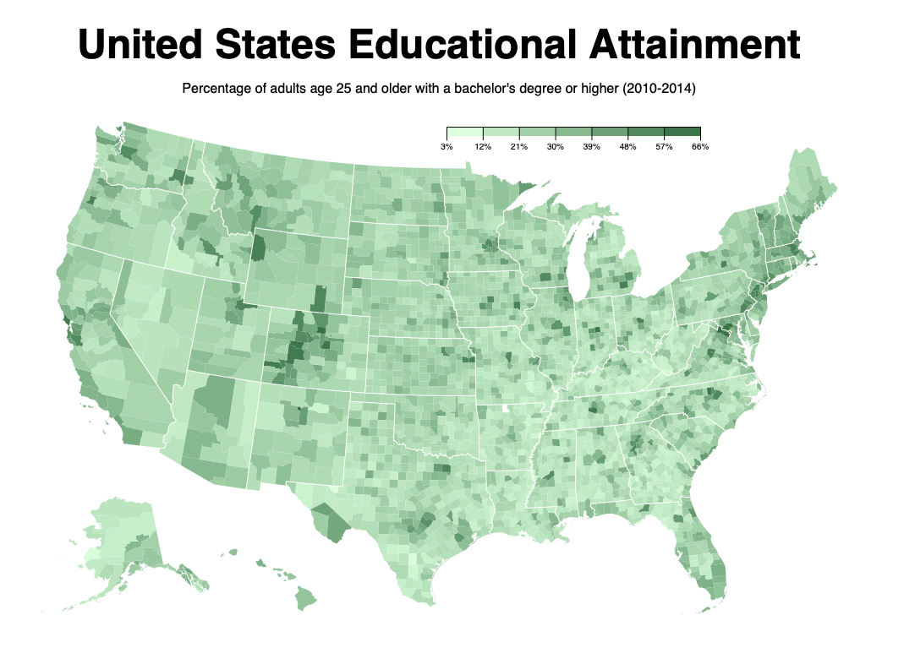

# 🚀 D3 Choropleth Map

A basic choropleth map example using D3, topoJSON and TypeScript.
It shows the percentage of educational attainment in the US per county, 
of those with a Bachelor's degree or higher.

Built for the freeCodeCamp Data Visualization Certificate.

A live build can be found [here](https://aaronishibashi.com/portfolio/web/d3-choropleth-map/).

## Build

```
npm install
npm run build
```
